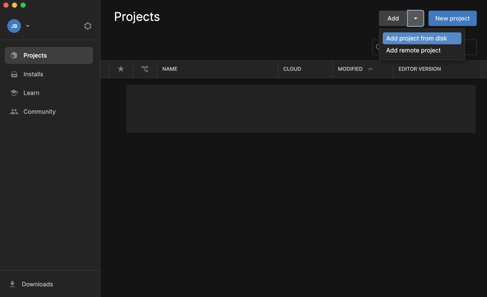
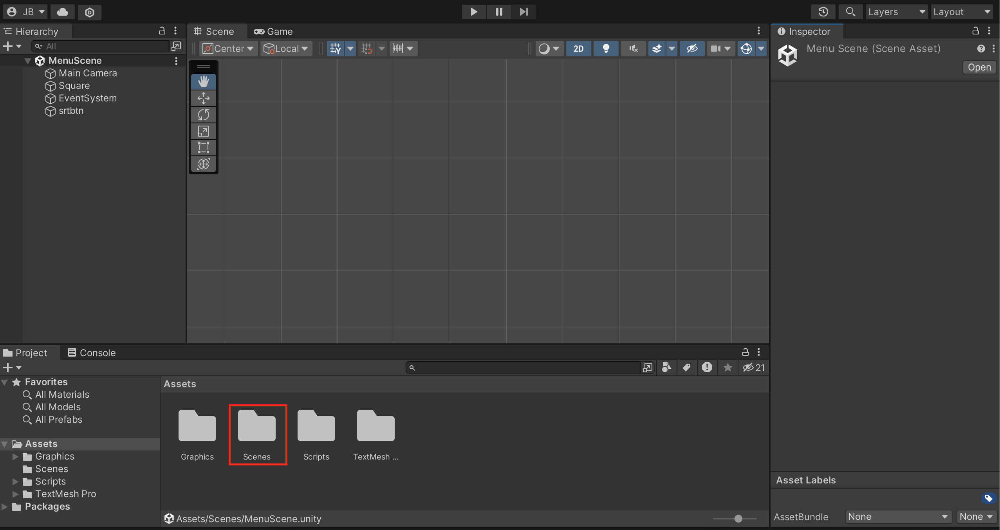
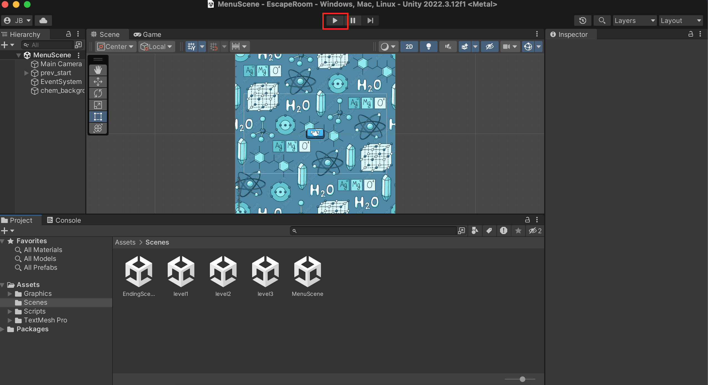
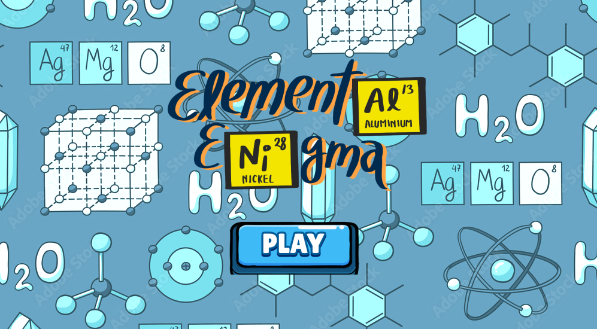
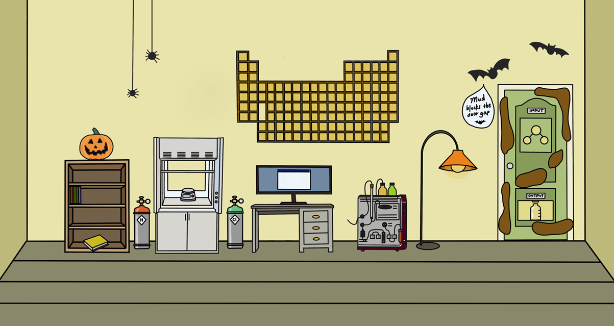
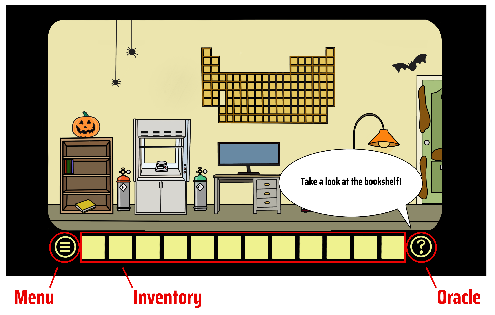
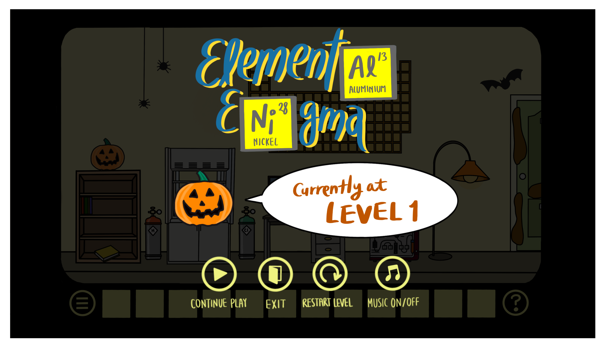

# Elemental Enigma

**Elemental Enigma** is a Unity-based serious puzzle game that combines fun and education. Players are tasked with escaping laboratories by synthesizing target molecules using elements and tools in the environment. Along the way, they’ll engage with interactive chemistry concepts, making this game both a thrilling challenge and a unique learning experience.
Demonstration on [Youtube](https://youtu.be/7hdgFt17QYM?si=w61lBxK-88kEGHMF)

---

## Table of Contents
1. [Introduction](#introduction)
2. [Installation Guide](#installation-guide)
3. [Gameplay Overview](#gameplay-overview)
4. [Game Features](#game-features)
5. [Contributing](#contributing)
   
---

## Introduction

In Elemental Enigma, players explore futuristic laboratories filled with interactive equipment and furniture. Your mission is to solve puzzles, create molecules, and unlock the doors to escape each lab. Along the way, you'll encounter powerful machines, hidden items, and an engaging backstory.

Beyond its engaging gameplay, Elemental Enigma is an innovative learning platform to deepen players' understanding of chemistry. By interacting with virtual equipment, experimenting with chemical elements, and using advanced tools like furnaces and chromatographers, players gain practical insights into chemical principles while having fun.

This unique blend of science and adventure ensures players enjoy the game and walk away with enhanced problem-solving skills and foundational knowledge in chemistry.

---

## Installation Guide

### Step 1: Install Unity
- Download Unity from the [official website](https://unity.com/download) and Follow this [installation guide](https://www.youtube.com/watch?v=ewiw2tcfen8) for detailed instructions.

### Step 2: Clone or Download the Repository
- Clone or download the ZIP file from this repository to your local machine:
    ```bash
    git clone https://github.com/shirleylin39/Elemental_Enigma.git
    ```

### Step 3: Open in Unity
- Open Unity, select ’Add project from disk' and navigate to your local repository. Select the ’**EscapeRoom**’ folder, and click open.
- Double-click the ’Scenes’ folder at the bottom, and then double-click the ’MenuScene’ icon to navigate to the start scene.
  




### Step 4: Play the Game
- Click the **Play** button in Unity's toolbar to begin your adventure!



---

## Gameplay Overview

### Start Scene
Begin your journey by pressing the Start button on the main menu. You can read the background story during the space scene to engage more deeply in the game, or simply press Skip to jump directly to Level 1.



### Laboratories
Explore labs of different themes, which are filled with interactive machines, collectable items, furniture, and chemical elements.
Your objective is to create the target molecule using the lab's tools and unlock the door to escape.



### Dead Scene/ End Scene
If you fail a level due to chemical mishaps, click the Replay button to try again.
If you successfully escaped, celebrate your success with an end scene and hidden Easter eggs.

---

## Game Interface
The Elemental Enigma interface provides an intuitive and engaging experience to immerse players in the puzzle-solving adventure. Here's a detailed breakdown of its main components:

### 1. Game Controls
Use the left arrow and right arrow keys to look across the room and explore the environment.
Click on objects in the room to interact with them and collect items.

### 2. Inventory
The inventory is your primary tool for managing collectable items as you progress through the game.
Collect items by clicking on them during gameplay. Once collected, they are stored in your inventory.
Drag and drop items from the inventory to interact with various objects or environments in the game.
Efficient inventory management is critical to successfully solving puzzles and escaping the laboratories.

### 3. Oracle
Need help? The Oracle provides random hints to guide you through the challenges.
Access the Oracle by clicking the question mark button at the bottom right corner of the screen.
While the Oracle gives helpful suggestions, it doesn’t reveal direct answers—you’ll need to think critically to escape.



### 4. Menu
Located at the bottom left corner, the menu provides various options to enhance your gameplay experience:
Continue Playing: Resume from your current progress.
- Exit: Leave the game at any time.
- Replay Level: Restart the current level to try a new approach.
- Music On/Off: Toggle background music on or off based on your preference.
The menu also displays information about your current level, giving you an overview of your progress.



---

## Contributing

### Branch Workflow
- Switch branches for specific levels:
    ```bash
    git checkout branch_name
    git pull origin branch_name
    ```
- Create a new branch for new features:
    ```bash
    git branch -b new_branch_name
    ```
- Commit and push changes:
    ```bash
    git add .
    git commit -m "Your message here"
    git push origin branch_name
    ```

### Unity Modifications
The majority of relevant files in the Unity project are in the ’Assets’ folder, which is split
into:
- Graphics
- Scenes
- Scripts
Navigate to the respective scene in Unity for the level you wish to edit, and test your changes thoroughly before committing.


